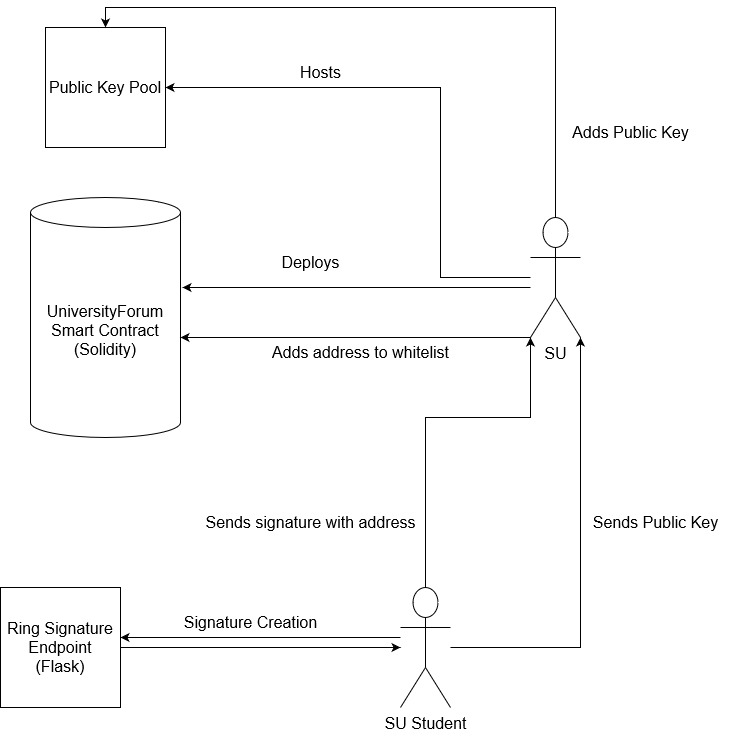
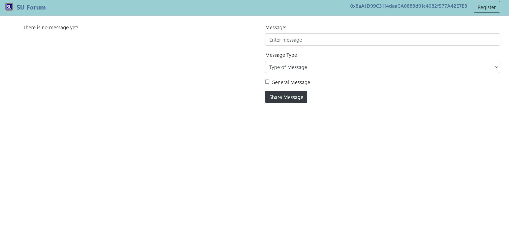
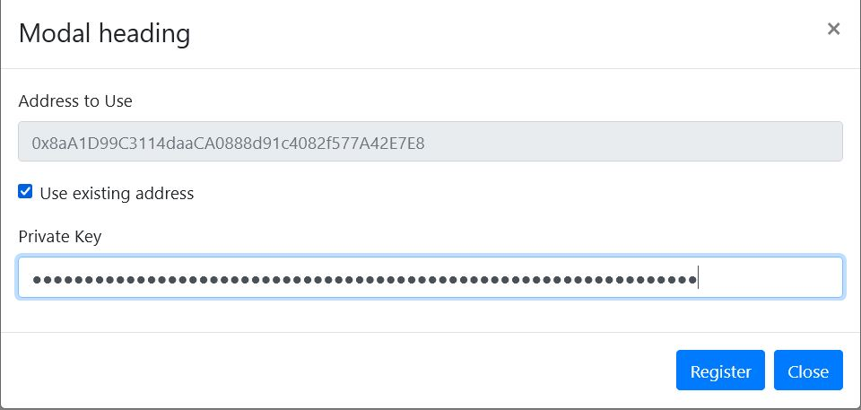
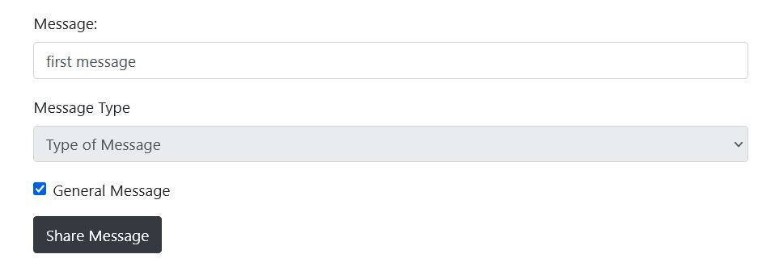
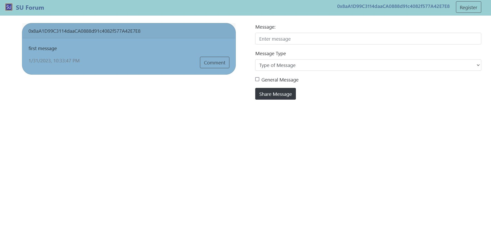
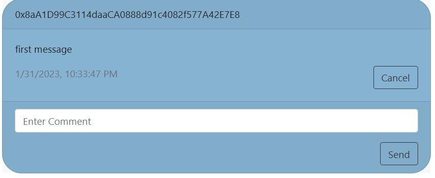
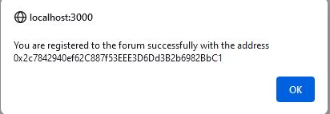
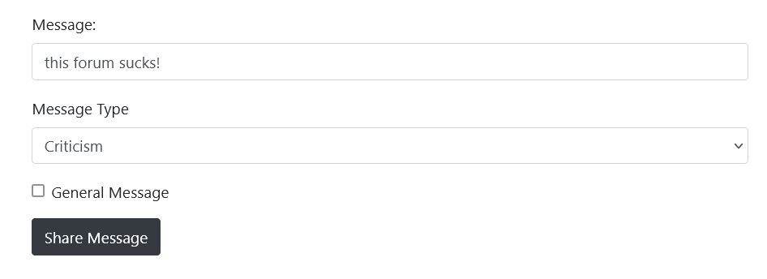
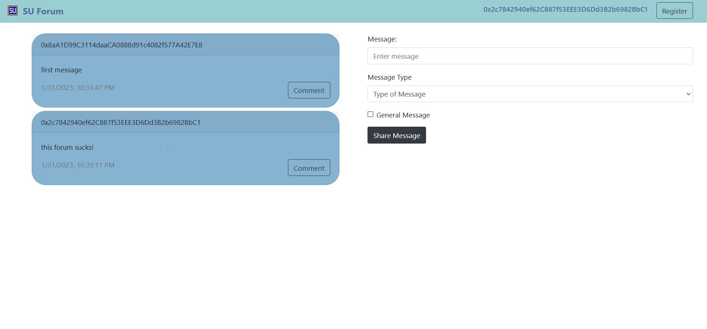

# SU-Forum
A university forum implementation on Ethereum blockchain

### Table of contents

* [Introduction](#introduction)
* [Motivation](#motivation)
* [Functionalities](#functionalities)
* [Flow of the System](#flow-of-the-system)
* [Project Setup](#project-setup)
* [Future Work](#future-work)
* [Screenshots](#screenshots)


### Introduction
This is a term project for our Blockchain course at Sabanci University. The project offers a forum that consists of "verifiable but anonymous users". What that means is the system can make sure that all the users are a member of a community (in this context, that community is Sabanci University) but at the same time protects their anonymity. And all of these are decentralized since it is built on top of the Ethereum blockchain. The anonimity aspect is possible by the implementation of a mechanism called Ring Signatures, a mechanism that is in use by some Cryptocurrencies such as Moreno.

### Motivation
Anonymity on the internet is an important concept for various reasons such as identity protection, the need for privacy in sensitive issues, freedom of expression, etc. But at the same time, it can create a problem with bot accounts, especially on social
media. As an example, we are living in a time the perception of individuals by society is mostly shaped by the discussions on social media. It can be seen what is the problem here. One can create and control hundreds, thousands, and millions of accounts for a purpose and manipulate any discussion, which is happening in big social media platforms like Twitter. Therefore, we need mechanisms for obtaining ‘anonymous but verifiable’
platforms. Our team believes that this can be possible with ‘Decentralized identities’, also
referred to as DIDs, with the support of blockchain technologies. This situation is also
applicable to smaller communities such as university forums.

### Functionalities
- Registering: New users can register to the system if they are a member of the Sabanci University. Check for details for that in the next section.
- Posting messages: Registered users can post messages in the forum. These messages are stored on the forum smart contract and can be seen by everyone.

For functionalities that has planned, check future works section...

### Flow of the System


In this section, I'll explain the flow of the system. 

In this case, we need to simulate the behavior of 3 parties in one project. These parties are 1) Contract Owner 2) Ring Signer 3) Client. Let's dive into each of them:

#### Contract Owner
Contract owner party is representing the university (SU) in this context. Students who want to register for the forum send their public key information to the university. This way, the university makes sure that the public key is coming from a student and no one else. University adds this public key to the public key pool which is open to everyone. 

Since we did not deploy the contract into any blockchain, we use Ganache for our local chain and deploy the contract there. On this side, we use a flask server to deploy the forum contract on top of the Ganache local blockchain and offer some endpoints to interact with it. These endpoints can be listed as follows:

- getPublicKeys -> As mentioned earlier, the public keys are shared, open to anyone, and controlled by the university. This GET request fetches the public keys.
- getConractAddress -> This was mostly for development reasons. As I was developing the project with each modification to the contract, the contract would be deployed to another address on the local chain. I wanted to automate the process of getting the contract address since the client side needs the address of the contract to interact with it.
- register -> This is a POST request to be sent by the client side to register the user into the forum. This function first of all uses the ring signature's verify algorithm to make sure the signature received is valid and is coming from a user who has a public key inside the pool while anonymity has still remained. Then, if there is no problem it interacts with the forum to add the address (which was the message itself, the client sends it in the website's register form) into the contract's 'whitelist'. This makes it possible for that address to post on the forum since only addresses in the 'whitelist' can post messages in the forum.

#### Ring Signing
This party was required because of a challenging situation during the development phase. To use ring signatures, I tried a lot of libraries that are listed in Github but few of them showed success. The fact that it's not the most popular topic made it harder to find good implementations and documentation about them. So, a lot of effort went into that department. 

Then, we got some success with the library ['Monero Ring Signatures'](https://github.com/kamsec/monero-ring-signatures) but the fact that it is written in Python was a problem since we need to use some part of it (signature creation algorithm) in the client side. For a time, I tried to convert the algorithms into JavaScript but I had some difficulties. After considering the time limit I decided to modify and use the code I got from the existing library and create a flask server and endpoints to use the algorithms. Hence, that is the motivation for the Ring Signing party.

The only endpoint:
signMessage -> A POST request to get the ring signature. Expects the 'msg' parameter which is the address for registration and 'pk' which is the private key of the public key which is inside the public key pool. 


#### Client Side
This party is the client, in this context the students who want to interact with the forum. It is a react project, starts the server in port 3000, and can be accessed from there. It offers all the functionalities that I've listed.

### Project Setup
I'll provide the steps for setting up the project on your local machine.
1. Open Ganache and start press Quickstart
2. Install the required packages for the ContractOwner project by using the following commands:

For Windows:
```
$ cd ContractOwner
$ python -m venv myenv
$ .\myenv\Scripts\activate
$ pip install -r .\requirements.txt
$ python app.py
```

For MacOS:
```
$ cd ContractOwner
$ python3 -m venv myenv
$ source .\myenv\bin\activate
$ pip3 install -r .\requirements.txt
$ python3 app.py
```
3. Start the flask server by typing `python app.py {deployer-address} {deployer-private-key}` (python3 for MacOS). You can get the address and private key from Ganache.
4. Install the required packages for the RingSigning project. You can use the same commands as step 2. Then, start the project in the local port by typing `python app.py` (python3 for MacOS).
5. Install the required packages for the ClientSide project and start it on a local port by using the following commands:
```
$ cd ClientSide
$ npm install
$ npm start
```
If you come across a problem here, it may be related to your node version. Adding `--openssl-legacy-provider` to the "scripts/start" part on package.json can solve this issue.

6. Go to http://localhost:3000 and you can see the forum page.

### Future Work
I want to continue to work on this project although the course is over. Because I feel like it can offer more features. First thing comes to my mind is to convert the signing algorithm that is written in Python to JavaScript to be able to use it in the client side without making any requests. Then, some functionalities can be added to the forum such as commenting, upvoting posts etc. On top of that I have an intention to deploy this project into Sabanci University ecosystem and offer it for public use. Only time will show us the results for that and I will be uploading here as the project progresses...

### Screenshots
#### First look to homepage after deploying the contract


#### Register form


#### Message form


#### Homepage after first message


#### Message card with comment part activated


#### Let's register one more user to the forum. Here is the confirmation


#### In case the new user did not like the forum


#### Homepage after the new message



